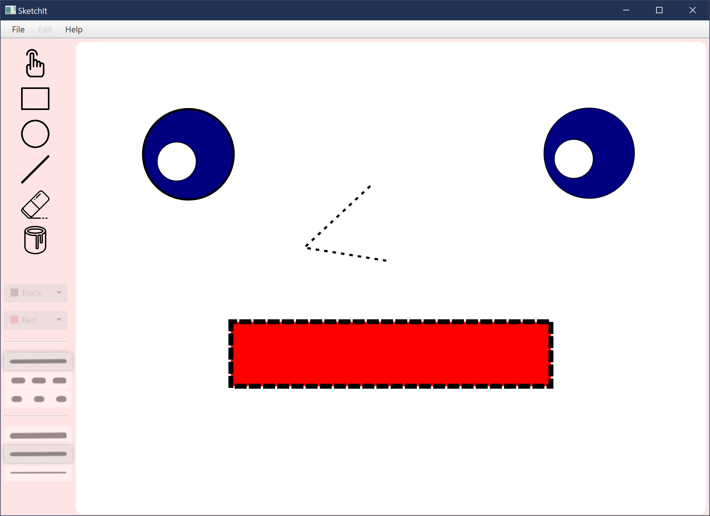

# SketchIt

A vector graphics drawing application

## Features
* Draw Lines
* Draw Rectangles
* Draw Circles
* Selection Tool
* Erase Tool
* Fill Tool
* Choose colors for lines/borders and fill color for shapes
* Choose line/border style (solid, dashed, dotted)
* Choose line/border thickness (thin, normal, thick)
* Save and load images for later use
* Copy/Paste/Cut shapes and lines

## Example
This is an example drawing, whose save file is [saveExample.txt](https://github.com/denisshapiro/SketchIt/blob/master/saveExample.txt)

Sources:
[Rectangle](https://www.flaticon.com/free-icon/rectangle_650190),
[Circle](https://www.flaticon.com/free-icon/dry-clean_481078),
[Line](https://www.flaticon.com/free-icon/diagonal-line_815548),
[Eraser](https://www.flaticon.com/free-icon/eraser_1076334),
[Paint Can](https://www.flaticon.com/free-icon/painter_227090),
[Selection Tool](https://www.flaticon.com/free-icon/tap_2353405)